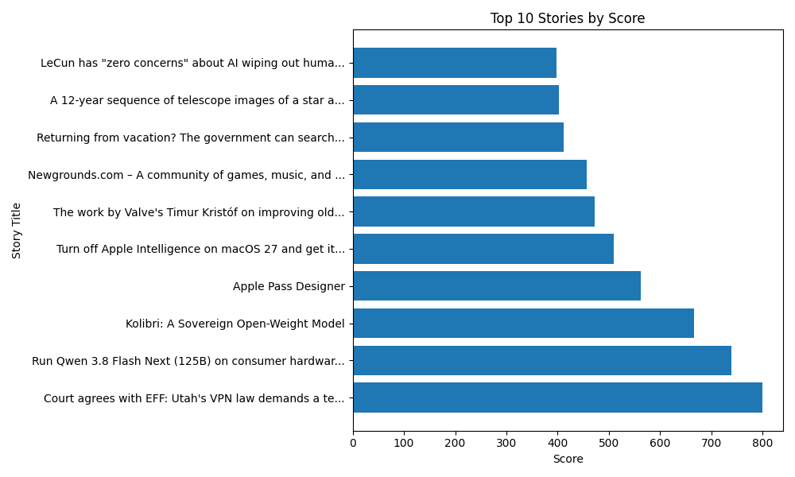
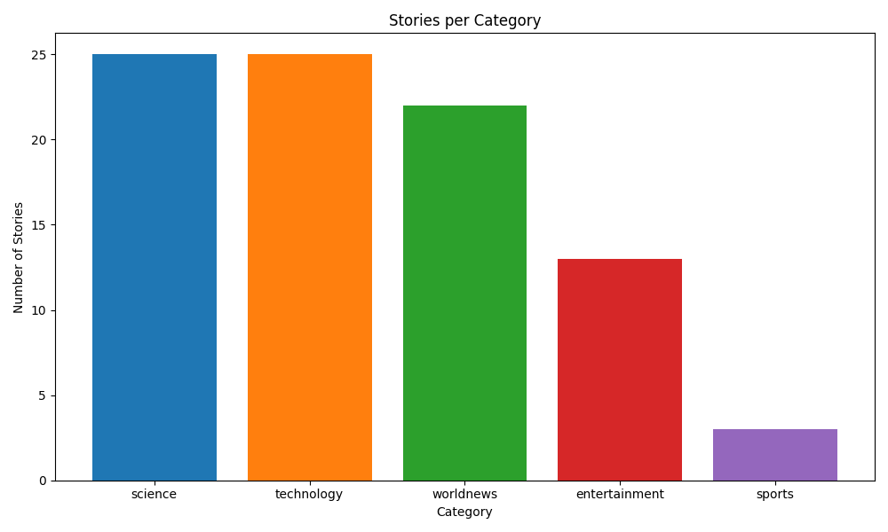
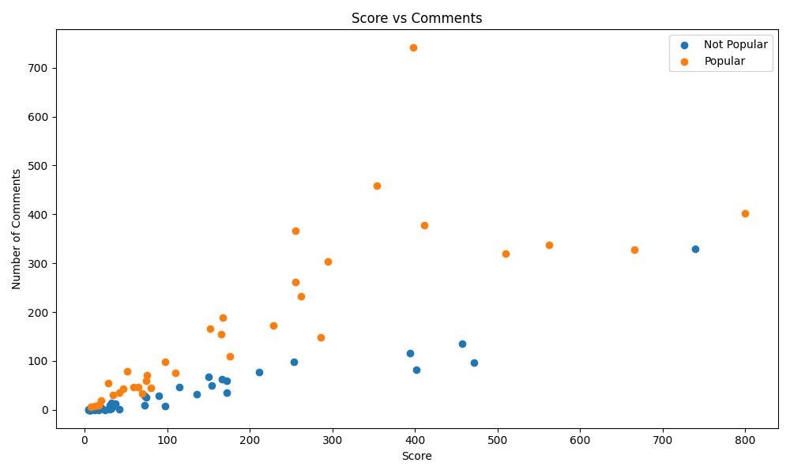
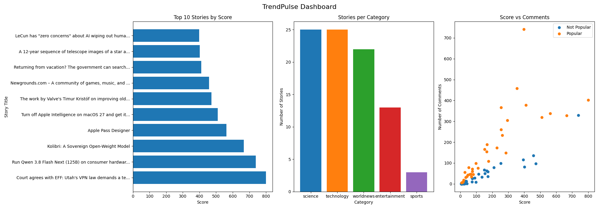

# TrendPulse: Hacker News Data Pipeline & Analysis

A Python data pipeline that collects trending Hacker News stories, cleans
them, analyzes scores and comments, and presents the results in a
dashboard.

## Project Overview
- Collects top stories from the Hacker News public API
- Classifies stories into five categories using whole-word keyword matching
- Cleans and prepares the data with Pandas
- Analyzes scores and engagement with NumPy and Pandas
- Visualizes the findings with Matplotlib

## Dataset
- Source: Hacker News public API (top stories, first 500 story IDs)
- Collected: 89 stories (up to 25 per category)
- After cleaning: 88 stories
- Categories after cleaning: science (25), technology (25),
  world news (22), entertainment (13), sports (3)
- Fields: post ID, title, category, score, number of comments, author,
  collection time, engagement, popularity flag

## Data Files
The `data/` folder contains the output of each pipeline stage:
- Raw collected stories (JSON), from Data_Collection
- Cleaned data (CSV), from task2_data_processing
- Analyzed data with engagement and popularity columns (CSV),
  from task3_analysis

## Workflow
1. **Data_Collection.ipynb**: fetches stories through API requests,
   classifies them with whole-word keyword matching (re), saves JSON
2. **task2_data_processing.ipynb**: loads the JSON, cleans the data with
   Pandas, saves a clean CSV
3. **task3_analysis.ipynb**: calculates mean, median and standard
   deviation with NumPy, creates the engagement metric and popularity flag
4. **task4_visualization.ipynb**: builds the charts and the dashboard
   with Matplotlib

## Key Metrics
- **Engagement** = number of comments relative to score
  (comments / (score + 1))
- **Popular story** = a story whose engagement is above the average
  engagement

## Key Findings (this sample only)
- Scores are right-skewed: the mean score is 134.7 but the median is 55.5,
  so a small number of very popular stories pull the average up.
- 35 of the 88 stories are flagged as popular.
- Science and technology are the largest categories (25 stories each),
  followed by world news (22). Sports has only 3 stories.
- Score and number of comments show a positive relationship: stories with
  higher scores tend to have more comments. This is an association, not
  proof of cause.

## Charts

## Tech Stack
Python, Pandas, NumPy, Matplotlib, Requests, JSON, re (regular
expressions), Jupyter/Google Colab, Git, GitHub

## Requirements
Libraries needing installation (listed in `requirements.txt`):
pandas, numpy, matplotlib, requests

Install them with:
pip install -r requirements.txt

Built-in Python modules used: json, os, time, datetime, re.

The notebooks use `google.colab.files` to upload and download data, so
they are designed to run in Google Colab. To run them elsewhere, replace
the upload cells with `pd.read_csv("data/your_file.csv")`.

## Limitations
- Small sample: 88 stories collected in a single run
- Hacker News is tech-focused, so some categories (especially sports)
  have very few stories
- Categories are assigned by keyword matching, so some stories may be
  misclassified
- Results describe this sample and may change on a different day

## How to Run
1. Open the notebooks in Google Colab
2. Run them in order: Data_Collection, task2_data_processing,
   task3_analysis, task4_visualization
3. Upload each notebook's input file when asked, using the files in
   `data/`, or generate new data by running Data_Collection first
